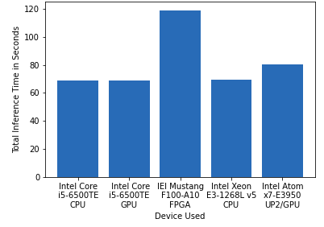
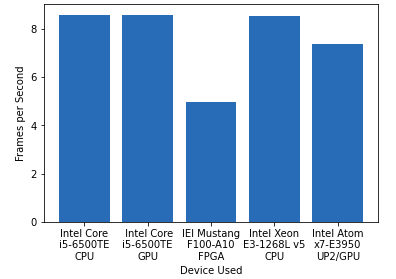
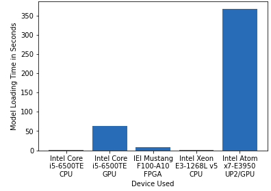
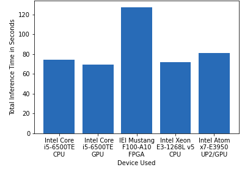
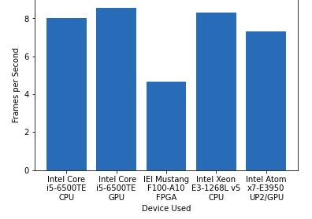
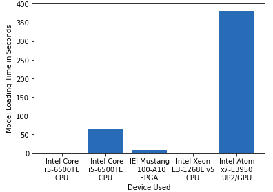

# Computer Pointer Controller

## Introduction
The Computer Pointer Controller app allows you to control the movement of the mouse pointer on the screen through your head position and gazing angles.

## Project Set Up and Installation
### Setup

#### Prerequisites
  - You need to install Intel openvino . <br/>
  See this [guide](https://docs.openvinotoolkit.org/latest/_docs_install_guides_installing_openvino_linux.html) for installing openvino.

#### Step 1
Clone the repository:- https://github.com/

#### Step 2
Initialize the openVINO environment:-
```
source /opt/intel/openvino/bin/setupvars.sh -pyver 3.5
```

#### Step 3

Download the following models by using openVINO model downloader:-

**1. Face Detection Model**
```
python /opt/intel/openvino/deployment_tools/tools/model_downloader/downloader.py --name "face-detection-adas-binary-0001"
```
**2. Facial Landmarks Detection Model**
```
python /opt/intel/openvino/deployment_tools/tools/model_downloader/downloader.py --name "landmarks-regression-retail-0009"
```
**3. Head Pose Estimation Model**
```
python /opt/intel/openvino/deployment_tools/tools/model_downloader/downloader.py --name "head-pose-estimation-adas-0001"
```
**4. Gaze Estimation Model**
```
python /opt/intel/openvino/deployment_tools/tools/model_downloader/downloader.py --name "gaze-estimation-adas-0002"
```

## Demo
To run the app on your local machine, Open the Terminal and run the following commands:

**1. Change the directory to src directory of project repository**
```
cd <project-repo-path>/src
```
**2. Run the main.py file**
```
python main.py -f <Path of xml file of face detection model> \
-fl <Path of xml file of facial landmarks detection model> \
-hp <Path of xml file of head pose estimation model> \
-g <Path of xml file of gaze estimation model> \
-i <Path of input video file or enter cam for taking input video from webcam> 
```

Example case:
```
python3 src/main.py -f intel/face-detection-adas-binary-0001/FP32-INT1/face-detection-adas-binary-0001.xml -fl intel/landmarks-regression-retail-0009/FP32/landmarks-regression-retail-0009.xml -hp intel/head-pose-estimation-adas-0001/FP32/head-pose-estimation-adas-0001.xml -g intel/gaze-estimation-adas-0002/FP32/gaze-estimation-adas-0002.xml -i bin/demo.mp4 -flags fd hp fld ge
```

- If you want to run app on GPU:-
```
python main.py -f <Path of xml file of face detection model> \
-fl <Path of xml file of facial landmarks detection model> \
-hp <Path of xml file of head pose estimation model> \
-g <Path of xml file of gaze estimation model> \
-i <Path of input video file or enter cam for taking input video from webcam> 
-d GPU
```
- If you want to run app on FPGA:-
```
python main.py -f <Path of xml file of face detection model> \
-fl <Path of xml file of facial landmarks detection model> \
-hp <Path of xml file of head pose estimation model> \
-g <Path of xml file of gaze estimation model> \
-i <Path of input video file or enter cam for taking input video from webcam> 
-d HETERO:FPGA,CPU
```

## Documentation
### Documentation of used models

1. [Face Detection Model](https://docs.openvinotoolkit.org/latest/_models_intel_face_detection_adas_binary_0001_description_face_detection_adas_binary_0001.html)
2. [Facial Landmarks Detection Model](https://docs.openvinotoolkit.org/latest/_models_intel_landmarks_regression_retail_0009_description_landmarks_regression_retail_0009.html)
3. [Head Pose Estimation Model](https://docs.openvinotoolkit.org/latest/_models_intel_head_pose_estimation_adas_0001_description_head_pose_estimation_adas_0001.html)
4. [Gaze Estimation Model](https://docs.openvinotoolkit.org/latest/_models_intel_gaze_estimation_adas_0002_description_gaze_estimation_adas_0002.html)

### Command Line Arguments for Running the app

Following are the command line arguments to use for running the main.py file ` python main.py `:-

  1. -h                : Get the information about all the command line arguments
  2. -fl    (required) : Specify the path of Face Detection model's xml file
  3. -hp    (required) : Specify the path of Head Pose Estimation model's xml file
  4. -g     (required) : Specify the path of Gaze Estimation model's xml file
  5. -i     (required) : Specify the path of input video file or enter cam for taking input video from webcam
  6. -d     (optional) : Specify the target device to infer the video file on the model. 
  Supported devices are: CPU,GPU,FPGA (For running on FPGA used HETERO:FPGA,CPU), MYRIAD.
  7. -l     (optional) : Specify the absolute path of cpu extension if some layers of models are not supported on the device.
  9. -prob  (optional) : Specify the probability threshold for face detection model to detect the face accurately from video frame.
  8. -flags (optional) : Specify the flags from fd, fld, hp, ge if you want to visualize the output of corresponding models of each frame.
  (write flags with space seperation. Ex:- -flags fd fld hp).

## Benchmarks
Benchmark results of the application.

### FP32

**Inference Time** <br/> 


**Frames per Second** <br/> 


**Model Loading Time** <br/> 


### FP16

**Inference Time** <br/> 


**Frames per Second** <br/> 


**Model Loading Time** <br/> 


### INT8
**Inference Time** <br/> 


**Frames per Second** <br/> 


**Model Loading Time** <br/> 


## Results
Having run the model on different hardwares:
1. Intel Core i5-6500TE CPU 
2. Intel Core i5-6500TE GPU 
3. IEI Mustang F100-A10 FPGA 
4. Intel Xeon E3-1268L v5 CPU 
5. Intel Atom x7-E3950 UP2 GPU

On comparing the model loading time, inference time and the Frames per second output following is my analysis.

- As seen from the graph FPGA took greater time for inference than any other device. FPGA is a self programmable piece of hardware and has following advantages:-
- It is robust and helps in custom solutions.
- It has also longer life-span compared to any other device.

- GPU performed very well compared to other devices in terms of Frames per second and especially with the FP16 format which it support greatly.

- Accuracy is the factor which is sensitive to precision. 

- Model size can be reduced by lowering the precision rate but then we need to compensate with the accuracy as much essential data is lost in conversion from FP32 to FP16/INT8


## Further Implementations
*Todo* Add a face authentication model.
*Todo* Using the rock paper scissor model add more functionalities like click,scroll.

### Edge Cases
To avoid certain edge cases following implementations are done:
1. If the model fails to predict a face it prints unable to detect the face and reads another frame.
2. If there are more faces detected, the model takes only one face for the control of the mouse.
